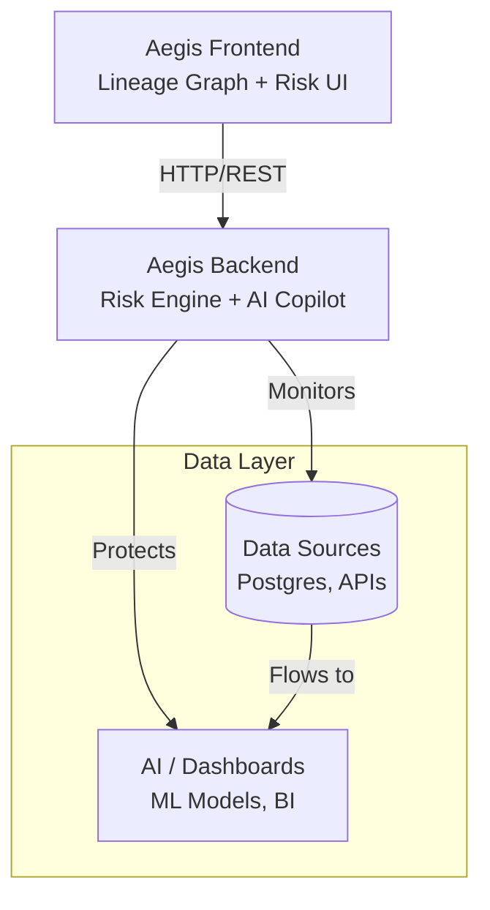

# 🛡️ Project Aegis
### AI Data Resilience & Schema Drift Defense Platform


---

## 📌 Overview
**Project Aegis** is a next-generation **data resilience and AI assurance platform** designed to defend modern data pipelines against **silent schema drift** — one of the most common and costly causes of AI model and analytics failures.

Aegis continuously monitors data lineage, simulates schema failures, calculates downstream blast radius, and auto-heals pipelines using AI-generated SQL virtual patches — all without downtime.

---

## ❗ Why This Exists — The Problem
Modern AI systems rely on complex data pipelines across databases, APIs, warehouses, and models. Small schema changes often cause:

* **Silent AI model corruption**
* **Broken dashboards and reports**
* **Incorrect business decisions**
* **Hours to days of debugging**

> **Static pipelines = Fragile pipelines.**

---

## 🚀 Core Innovation: Data Lineage–Driven Risk Engine
Aegis treats data pipelines as a **connected graph**, not isolated tables. By modeling sources, transformations, warehouses, and AI consumers as a dependency graph, Aegis can:

1.  **Predict impact** before failure occurs.
2.  **Measure blast radius** in milliseconds.
3.  **Translate technical failure** into business risk (Data VIX).

---

## ⭐ Key Features
* 🧠 **End-to-End Data Lineage Visualization**
* 💥 **Schema Drift Simulation (Chaos Injection)**
* 📉 **Real-Time Blast Radius Analysis**
* 📊 **Data VIX Risk Scoring (0–100)**
* 🤖 **AI-Generated SQL Remediation (Virtual Patching)**
* 🩺 **One-Click Global Heal**
* ☁ **Cloud-Native, Scale-to-Zero Architecture**

---

## 🧰 Technology Stack

| Component | Technology |
| :--- | :--- |
| **Language** | Python 3.10, TypeScript |
| **Backend** | FastAPI |
| **Frontend** | React 18 (Vite) |
| **Visualization** | React Flow |
| **State Management** | Zustand |
| **Containerization** | Docker |
| **Cloud Platform** | Google Cloud Run |
| **Registry** | Google Container Registry |

---

## 🏗 Architecture



*(If Mermaid is not supported in your viewer, see the ASCII representation below)*

```text
    ┌───────────────────────────────┐
    │        Aegis Frontend         │
    │  (Lineage Graph + Risk UI)    │
    └──────────────┬────────────────┘
                   │
                   v
    ┌───────────────────────────────┐
    │        Aegis Backend          │
    │   (Risk Engine + AI Copilot)  │
    └──────┬─────────────────┬──────┘
           │                 │
           v                 v
┌────────────────────┐  ┌──────────────────┐
│    Data Sources    │  │  AI / Dashboards │
│  (Postgres, APIs)  │  │  (ML Models, BI) │
└────────────────────┘  └──────────────────┘

```

---

## 📁 Project Structure

```text
aegis-platform/
│
├── deploy_aegis.sh         # Deployment script
├── docker-compose.yml      # Local composition config
├── test_aegis.sh           # Testing script
├── repair_stuff.py         # Utility script
├── f1.py                   # Utility script
├── schema_diagram.png      # Architecture visual
├── README.md
│
├── backend/
│   ├── Dockerfile
│   ├── requirements.txt
│   └── app/
│       ├── main.py             # App entry point
│       ├── config.py           # Configuration loading
│       ├── schemas.py          # Pydantic models
│       ├── routers/
│       │   ├── chaos.py        # Chaos engineering routes
│       │   └── remediate.py    # Remediation routes
│       └── services/
│           ├── ai_agent.py     # AI Copilot logic
│           ├── bigquery.py     # BQ interaction service
│           └── vix_calc.py     # Data VIX calculation logic
│
└── frontend/
    ├── Dockerfile
    ├── package.json
    ├── vite.config.ts
    ├── tailwind.config.js
    ├── env.sh
    └── src/
        ├── App.tsx
        ├── main.tsx
        ├── components/
        │   ├── FlowGraph.tsx   # React Flow visualization
        │   ├── ChaosBar.tsx    # Chaos injection UI
        │   ├── Copilot.tsx     # AI Assistant UI
        │   ├── Inspector.tsx   # Node details inspector
        │   └── VixGauge.tsx    # Risk meter component
        ├── hooks/
        │   └── useAegis.ts     # Custom hook for API calls
        ├── store/
        │   └── chaosStore.ts   # Zustand state management
        ├── lib/
        │   ├── api.ts          # Axios configuration
        │   └── utils.ts        # Helper functions
        └── data/
            ├── mock_graph.json # Initial graph state
            └── red_state.json  # Simulation state
```

---

## ⚙ Installation

### 1. Clone the Repository

```bash
git clone https://github.com/DeveshMudaliar1/Aegis-platform.git
cd Aegis-platform

```

### 2. Run Backend

```bash
# Navigate to backend
cd backend

# Run the server (Ensure dependencies are installed)
uvicorn backend.main:app --reload

```

### 3. Run Frontend

```bash
# Navigate to frontend
cd frontend

# Install dependencies
npm install

# Run development server
npm run dev

```

---

## ☁ Deployment

Aegis is deployed using **Google Cloud Run** with a scale-to-zero strategy.

🔴 **Live Demo:** [Launch Aegis Platform](https://aegis-frontend-1079363418946.us-central1.run.app/)

---

## 🧭 Future Roadmap

* [ ] Real-time production data connectors
* [ ] Automated CI/CD schema checks
* [ ] Multi-tenant enterprise support
* [ ] AI-driven root cause explanation

---

## 📜 License

Distributed under the **MIT License**.

```


